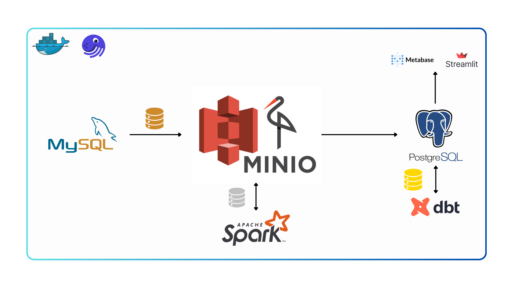

# Olist Brazilian E-Commerce Data Platform

This project involves building data pipelines for the final analytics on the Olist Brazilian E-commerce dataset. 

## I. Introduction

The Data Platform Project aims to provide a robust and scalable solution for managing and analyzing large datasets. The platform integrates various data sources, processes data efficiently, and offers tools for data analysis and visualization. This project is designed to support data engineers, data scientists, and analysts in extracting valuable insights from data.

## II. Features

This project provides a data platform for the final analytical application based on **Metabase** and **Streamlit**. The large amount of data could be processed in partitions and scheduled using [Dagster](https://dagster.io/). The system utilized [dbt](https://www.getdbt.com/) to perform analytics on the data which are stored in [MinIO](https://min.io/). Additionally, I also integrated Spark into the system for some innovation and advanced features in the future.

## III. Architecture

### Directory Tree

Since everything is dockerized, there are some folders are used as building contexts (`dagster, etl_pipeline, spark, streamlit`) and mounting data point (`data`) for services' containers. Those services are build upon the docker-compose.yaml located in the root folder with env files.

```
dockerized_pipeline/
│
├── app
│   ├── pages
│   │   └── ...
│   └── streamlit_app.py
│
├── dagster
│   ├── Dockerfile
│   └── requirements.txt
│
├── dagster_home
│   ├── dagster.yaml
│   └── workspace.yaml
│
├── data
│   ├── metabase
│   ├── metabase_psql
│   ├── minio
│   ├── mysql
│   └── postgresql
│
├── etl_pipeline
│   ├── brazilian_ecom
│   │   ├── analyses
│   │   ├── dbt_packages
│   │   ├── logs
│   │   ├── macros
│   │   ├── models
│   │   │   └── analytics
│   │   │   │   ├── ...
│   │   │       └── source.yaml
│   │   │
│   │   ├── seeds
│   │   ├── snapshots
│   │   ├── target
│   │   └── tests
│   │
│   ├── etl_pipeline 
│   │   ├── assets
│   │   │   ├── __init__.py
│   │   │   ├── bronze_layer.py
│   │   │   ├── silver_layer.py
│   │   │   └── ...
│   │   │
│   │   ├── resources
│   │   │   ├── __init__.py
│   │   │   ├── minio_io_manager.py
│   │   │   ├── mysql_io_manager.py
│   │   │   └── ...
│   │   │
│   │   ├── constant.py
│   │   └── __init__.py
│   │
│   ├── logs
│   ├── Dockerfile
│   ├── requirements.txt
│   └── spark-defaults.conf
│
├── spark
│   ├── Dockerfile
│   └── spark-defaults.conf
│
├── streamlit
│   ├── Dockerfile
│   └── spark-defaults.conf
│
├── docker-compose.yaml
├── env
├── metabase_psql_env
├── spark_master_env
├── spark_worker_env
└── Makefile
```
### Architecture Overview
#### Bronze Layer
- **Data Source:** MySQL database
- **Storage:** MinIO
- **Purpose:** Raw data extraction and storage.

#### Silver Layer
- **Processing Framework:** Apache Spark
- **Data Warehouse Schema:** Stored in PostgreSQL
- **Purpose:** 
  - Preprocessing and transformation of raw data into a structured format (dimensional and fact tables).
  - Enabling Exploratory Data Analysis (EDA) and Machine Learning tasks.

#### Gold Layer
- **Transformation Tool:** dbt (Data Build Tool)
- **Analytics and Visualization:** Metabase
- **Purpose:**
  - Transform and perform advanced analytics on the data.
  - Store refined data for efficient querying and reporting.

#### Visualization
- **Tool:** Streamlit
- **Purpose:** 
  - Provide interactive dashboards and reports to end-users.
  - Enable easy data exploration and insights generation.

### Dockerization

The entire system is dockerized to achieve the following purposes:
- **Isolation:** Ensures that each component runs in its own container, isolated from other components.
- **Consistency:** Provides consistent environments across development, testing, and production.
- **Scalability:** Allows easy scaling of individual components as needed.
- **Portability:** Ensures the system can be easily deployed on any environment that supports Docker.

### Detailed Workflow and Data Lineage




## IV. Dataset

The Olist Brazilian E-commerce dataset is utilized in this project. This dataset provides comprehensive data on orders, customers, products, reviews, and more, offering a detailed view of an online retail business in Brazil.


### Tables and Attributes

**1. Orders:** Contains information about each order placed on the Olist platform.

| Attributes| Description|
| :-- | :-- |
| `order_id` | Unique identifier for the order |
| `customer_id` | Status of the order (e.g., delivered, shipped, canceled)|
| `order_purchase_timestamp` | Timestamp when the order was placed |
| `order_approved_at` | Timestamp when the payment was approved |
| `order_delivered_carrier_date` | Date when the order was handed to the logistics partner |
| `order_delivered_customer_date` | Date when the order was delivered to the customer |
| `order_estimated_delivery_date` | Estimated delivery date for the order|

**2. Order Items:** Contains details about the items in each order.

| Attributes| Description|
| :-- | :-- |
| `order_id` | Unique identifier for the order |
| `order_item_id` | Identifier for the item within the order|
| `product_id` | Unique identifier for the product|
| `seller_id` | Unique identifier for the seller|
| `shipping_limit_date` | Last date the seller can ship the item|
| `price` | Price of the item|
| `freight_value` | Shipping cost for the item|

**3. Products:** Details about each product available on the platform.

| Attributes | Description |
| :-- | :-- |
| `product_id` | Unique identifier for the product |
| `product_category_name` | Category of the product in Portuguese |
| `product_category_name_english` | Category of the product in English |
| `product_name_length` | Length of the product name |
| `product_description_length` | Length of the product description |
| `product_photos_qty` | Number of photos of the product |
| `product_weight_g` | Weight of the product in grams |
| `product_length_cm` | Length of the product in centimeters |
| `product_height_cm` | Height of the product in centimeters |
| `product_width_cm` | Width of the product in centimeters |

**4. Customers:** Information about the customers.

|Attributes | Description |
| :-- | :-- |
| `customer_id` | Unique identifier for the customer |
| `customer_unique_id` | Unique identifier for the customer across all orders |
| `customer_zip_code_prefix` | First five digits of the customer zip code |
| `customer_city` | City of the customer |
| `customer_state` | State of the customer |

**5. Sellers:** Details about the sellers on the platform.

| Attributes | Description |
| :-- | :-- |
| `seller_id` | Unique identifier for the seller |
| `seller_zip_code_prefix` | First five digits of the seller zip code |
| `seller_city` | City of the seller |
| `seller_state` | State of the seller |

**6. Order Payments:** Information about payment transactions for each order.

| Attributes | Description |
| :-- | :-- |
| `order_id` | Unique identifier for the order |
| `payment_sequential` | Payment sequential number |
| `payment_type` | Type of payment (e.g., credit card, boleto) |
| `payment_installments` | Number of installments chosen for payment |
| `payment_value` | Total payment amount |

**7. Geolocation:** Geolocation data related to Brazilian zip codes.

| Attributes | Description |
| :-- | :-- |
| `geolocation_zip_code_prefix` | First five digits of the zip code |
| `geolocation_lat` | Latitude coordinates |
| `geolocation_lng` | Longitude coordinates |
| `geolocation_city` | City name |
| `geolocation_state` | State code |

**8. Product Category Name Translation:** Translation of product category names from Portuguese to English.

| Attributes | Description |
| :-- | :-- |
| `product_category_name` | Category name in Portuguese |
| `product_category_name_english` | Category name in English |

## V. Setup

### Prerequisites

- Docker
- Docker Compose
- Python 3.10
- DBeaver

### Steps to Deploy
**1. Clone the Repository**
   ```bash
   git clone https://github.com/nchiht/brazilian_ecommerce_data_platform.git
   cd brazilian_ecommerce_data_platform
   ```
#### Notice
Create a `env` file in the project's root folder with the format of `env_example` and assign value for each environment variable.

**2. Run Docker containers**

```bash 
# Build docker contexts and images 
docker compose build

#Create and start containers
docker compose up
```

**3. Prepare MySQL datasource**

Download the dataset from [here](https://www.kaggle.com/datasets/olistbr/brazilian-ecommerce) and put all the .csv files in the directory ```init_mysql/brazilian-ecommerce```

Load dataset into MySQL database:
```bash
# copy CSV data to mysql container
docker cp init_mysql/brazilian-ecommerce/ de_mysql:/tmp/

# copy SQL script data to mysql container
docker cp mysql_scripts.sql de_mysql:/tmp/
docker cp mysql_import.sql de_mysql:/tmp/

# run commands to create tables
docker exec -it de_mysql mysql --local_infile -u"${MYSQL_USER}" -p"${MYSQL_PASSWORD}" ${MYSQL_DATABASE} -e"source /tmp/mysql_scripts.sql"

# run commands to load data into tables
docker exec -it de_mysql mysql --local_infile -u"${MYSQL_USER}" -p"${MYSQL_PASSWORD}" ${MYSQL_DATABASE} -e"source /tmp/mysql_import.sql"
```

## VI. Interfaces

1. http://localhost:3001 - Dagster
2. http://localhost:4040 - Spark jobs
3. http://localhost:8080 - Spark master
4. http://localhost:9001 - MinIO
5. http://localhost:3000 - Metabase
6. http://localhost:8501 - Streamlit

## VII. Further works

- Apply Spark ML Lib
- Make a more comprehensive dashboard
- Works with more complex datasource (handle from multi-sources, APIs, etc)

---

## Acknowledgements

I would extend my special thanks to Mr. Hung Le and Assoc. Prof. Nguyen Thanh Binh, for their invaluable support and guidance throughout this project.

Acknowledge any resources, libraries, or individuals that contributed to the project:

- The Olist Brazilian E-Commerce Dataset is provided by [Kaggle](https://www.kaggle.com/datasets/olistbr/brazilian-ecommerce)
- Libraries and tools used: This project is completed using several skills and tools I obtained through out the Fundamental Data Engineer (FDE06) - AIDE Institute.
